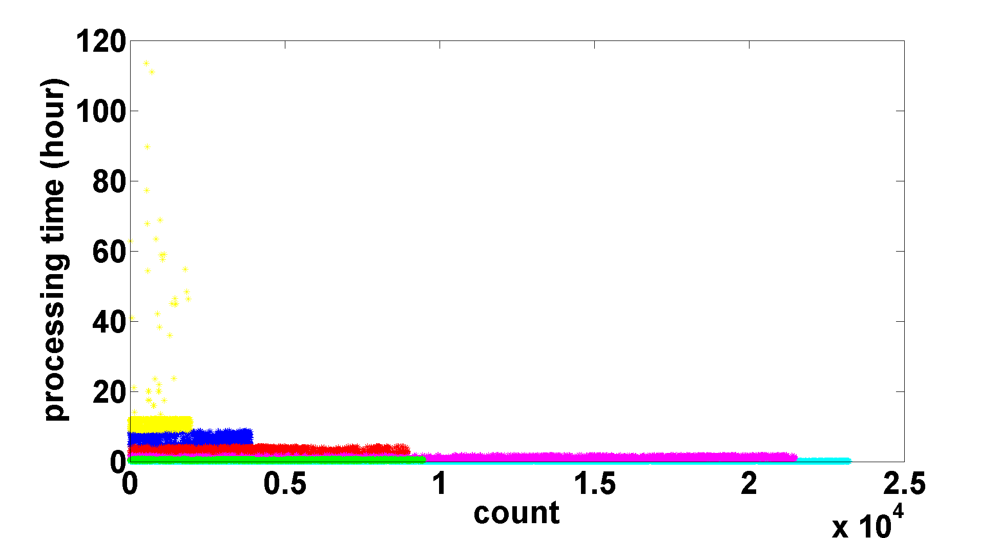

## Process ANL-Intrepid 

### 1. Intro
- The scripts in this folder have the objective to calculate the statistics information of parallel jobs. In specific, the job traces is from [ANL-Intrepid](../traces/intrepid.md).

### 2. Files
|file| function|
|:---|:--------|
|[pystats.py](./pystats.py)| tool function to process data by column, tool provided by [Zhonghua Xi](https://github.com/xizhonghua/pystats)|
|[getColumn.py](./getColumn.py)| tool function to extract target column from file|
|[process-intrepid.py](./process-intrepid.py)| process jobs' running time|
|[getHistogram.m](./getHistogram.m)| plot histogram of processing time|
|[getKMean.m](./getKMean.m)| plot k-mean of processing time|

--
### 3. Experiment 1: Analyze Processing Time
#### How to run
- Step1: pre-processing workloads, make the sperator in each column as a single space
  - open input data `ANL-Intrepid-2009-1.swf` using note-pad++
  - repace 4-space `    ` with 2 spaces `  `
  - repace all 2-space `  ` with 1 space ` `
- Step2: calculate statistics of processing time. Take `'../data/ANL-Intrepid-2009-1.swf/ANL-Intrepid-2009-1.swf'` as input.

```
python process-intrepid.py
```

#### Statistics (in seconds)

|Job \#| Mean| Variance| SteDev| Sum|
|:------|:------|:------|:------|:------|
| 68936| 5176.3476| 81807258.969| 9044.737| 356836696.0| 

Min| Max| Median| Confidence| Conf.L| Conf.U|
|:------|:------|:------|:------|:------|:------|
|10.0| 408773.0| 3607.5 |0.95| 5108.828| 5243.868|

#### Histogram
- How to run
  - Step 1: extract processing time column
    - Format `python .\getColumn.py [Skip-lines] [Columns] [InputFile] [OutputFile]`
    - Example 
    ```
    python .\getColumn.py 15 4 ..\data\ANL-Intrepid-2009-1.swf\ANL-Intrepid-2009-1.swf ..\data\ANL-Intrepid-2009-1.swf\processTim
  e.txt
    ```
  - Step 2: plot histogram
- Figures
  - Fig 1: histogram of processing time of all jobs
  - Fig 2: histogram of processing time of all jobs, jobs with processing time larger than 24 hours are filtered out.
  
|Fig 1:Histogram Of Processing Time| 
|:--| 
|| 

|Fig 2:Histogram Of Processing Time with filtering of large jobs| 
|:--| 
|| 

#### K-mean Clustering
- How to run
- Figures
  - Fig 3: cluster the processing time using k-mean with k = 6
  
|Fig 3: K-mean clustering of processing time (k=6)| 
|:----|
||


### 4. Experiment 2: Analyze Arrive Time
#### How to run
- Step 1: get arrival time column (column =2)
  - Format: `python .\getColumn.py [Skip-lines] [Columns] [InputFile] [OutputFile]`
  - Example: 
  ```
  python .\getColumn.py 15 2 ..\data\ANL-Intrepid-2009-1.swf\ANL-Intrepid-2009-1.swf ..\data\ANL-Intrepid-2009-1.swf\arrivalTim
e.txt
```

#### Inter arrival time
- Get data
  - get inter arrival time from arrival time using the following command
  `python .\getInterArrivalTime.py ..\data\ANL-Intrepid-2009-1.swf\arrivalTime.txt ..\data\ANL-Intrepid-2009-1.swf\interArrivalTime.txt`
